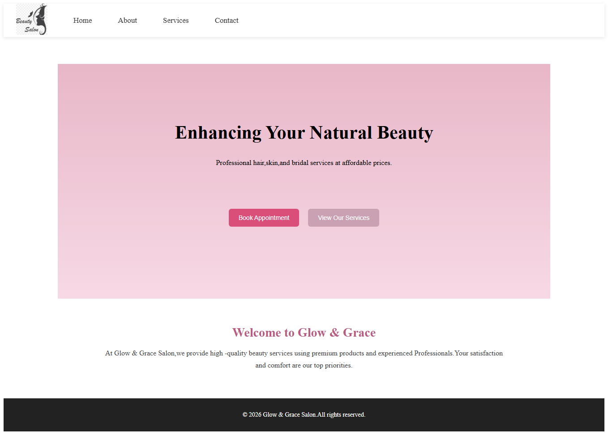
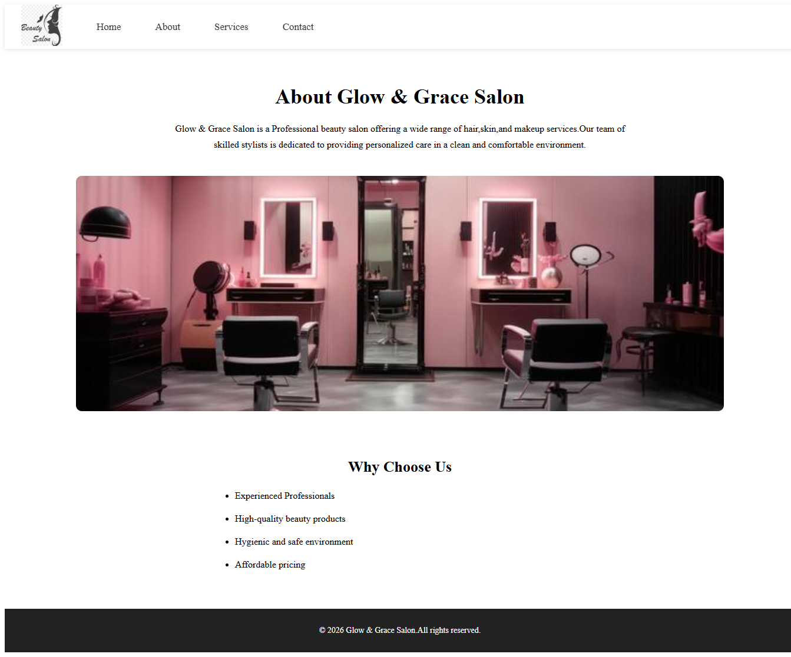
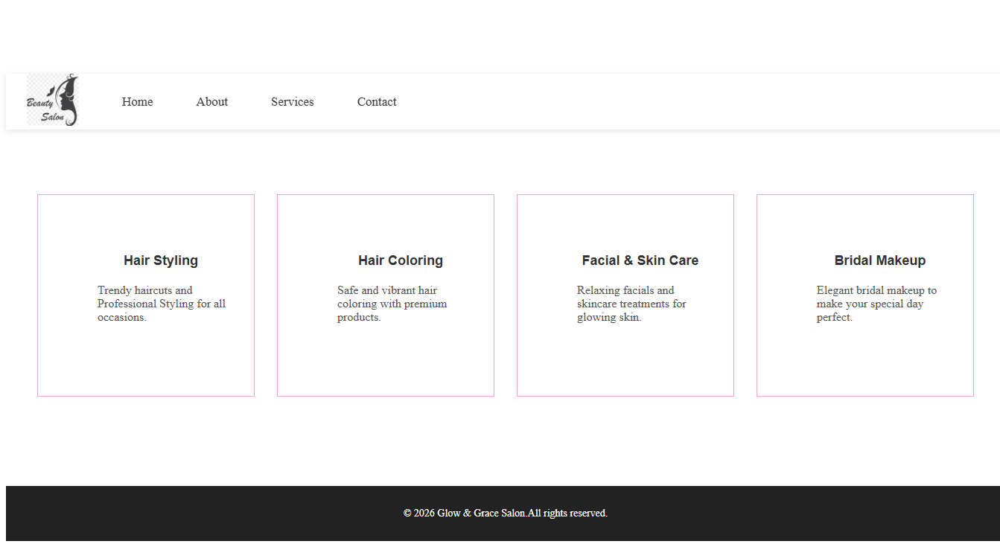
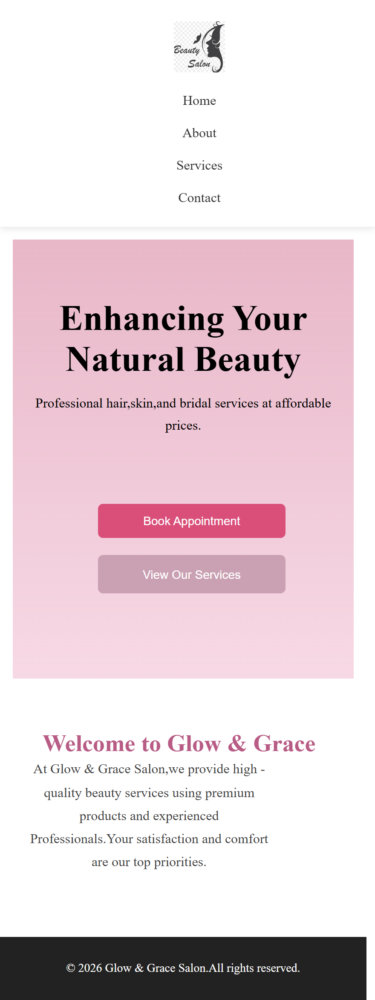
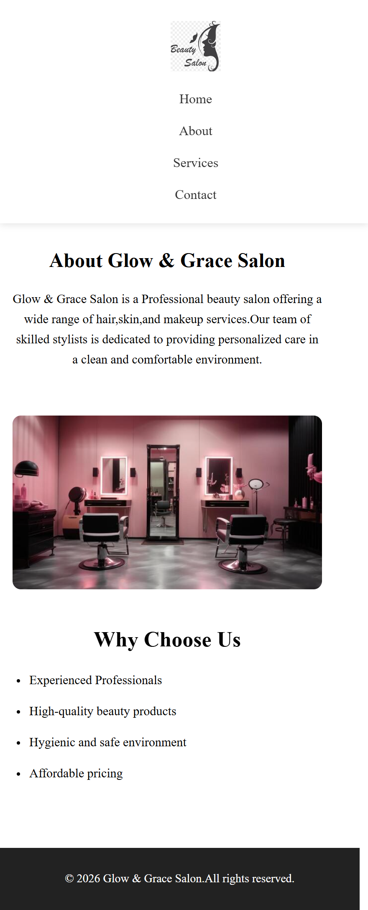
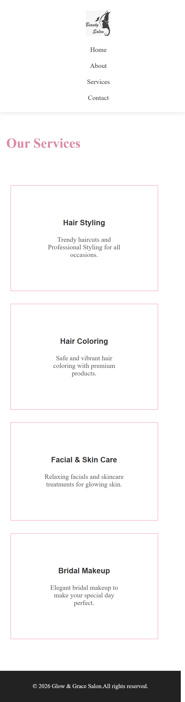
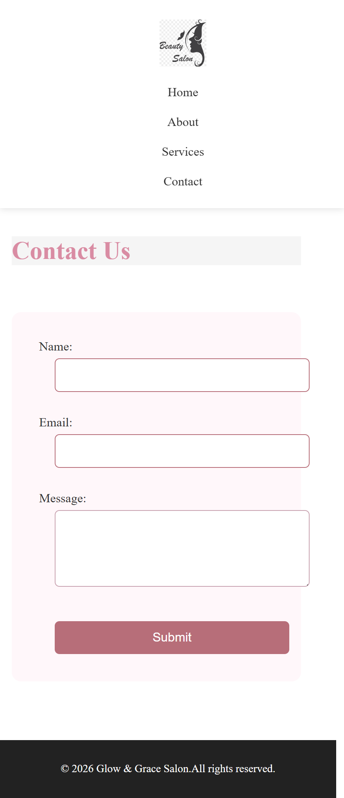

#Salon Website

A responsive salon website built using HTML,CSS and JAVAScript.
Designed to work smoothly on both desktop and mobile devices.

---
##Live Website
 https://vyshnavi-220466.github.io/glow-grace-salon/

 ---
 ##Technologies Used
 -HTML5
 -CSS
 -JAVAScript

 ---
 ##Features
 -Responsive design(Desktop & Mobile)
 -Home,About,Services,Contact pages
 -Interactive contact form
 -Clean and modern UI

---
##Screenshots
###Desktop View
**Home Page**

**About Page**

**Services Page**

**contact Page**

---
###Mobile View

 
